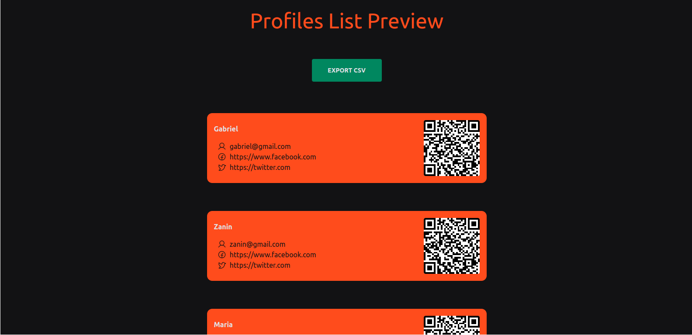

[](https://github.com/ZaninDe)
[](#)
[](https://github.com/ZaninDe/unitok-challenge/stargazers)
[](https://github.com/ZaninDe/unitok-challenge/network/members)
[](https://github.com/ZaninDe/unitok-challenge/graphs/contributors)


## 💻 Project
- This is a simple project with NextJs + api to view registered profiles.
- When QR code profile is scanned, you will be redirect to profile route.

# :camera: Screenshots
<div align="center">
   
</div>

## 🧪 Tech
- [Next](https://nextjs.org/)
- [TailWind CSS](https://tailwindcss.com/)
- [Vercel](https://vercel.com/)

## 🛠️ Feactures
- you can attach a screenshot in feedback.
- everything works through the keyboard.
> ### ➕ Added
> - the theme will be able to changed to light/dark.


## 📄How to run
Clone this repository.
```bash
git clone https://github.com/ZaninDe/unitok-challenge
```
```bash
$ cd unitok-challenge
```

```bash
$ npm install
```

```bash
$ npm run dev
```

## 💭 Bonus
- See the project running with this [URL](https://unitok-challenge-49jwsj3gj-zaninde.vercel.app/).
